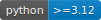

# rye-template

A template for a Python library managed with [Rye](https://rye.astral.sh/).

Maintained by

- Firstname Lastname (mail@address.com)

## Version 0.0.1

Contents

- 🐍 **Rye-based Python project structure**, including a preconfigured tests section and
dependency management via Rye (virtual environments and Python version handling
included)
- 🔧 **Selection of common code style tools:** Ruff, PyTest, and MyPy
- 🔄 **GitHub Actions setup** for continuous integration
- 📚 **Separate documentation structure** with a prefilled development section, including handy notes on the tools used
- 📖 **ReadMe file** with badges and basic project structure
- 💻 **Starter code:** Basic "Hello World" example demonstrating correct import paths
for source code and tests

## Quick Start

To set up the project directory, perform the following steps:

1. Click `Use this template` and create your own repository.
2. Rename the root directory `rye-template` and `src/rye_template/` to match your
desired project name.
3. Adjust project description in `pyproject.toml` and `README.md`.
4. Set your python version in the file `.python-version`.
5. Install [Rye](https://rye.astral.sh/), if you have not yet.
6. Run `rye sync --update-all` in the shell to set up the project's virtual environment.

### Required Environment Variables

To run this project, the following environment variables must be provided in an
`.env` file or the system's environment:

| Variable Name | Description | Default Value
|-|-|-|
|`PLACEHOLDER_ENV_VAR`|Only an example variable.|`None`|

## Documentation

For detailed documentation, please refer to the sections below

- [Navigation](docs/navigation.md)
